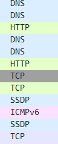
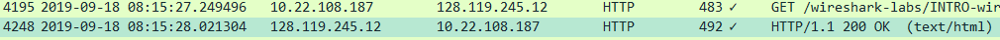
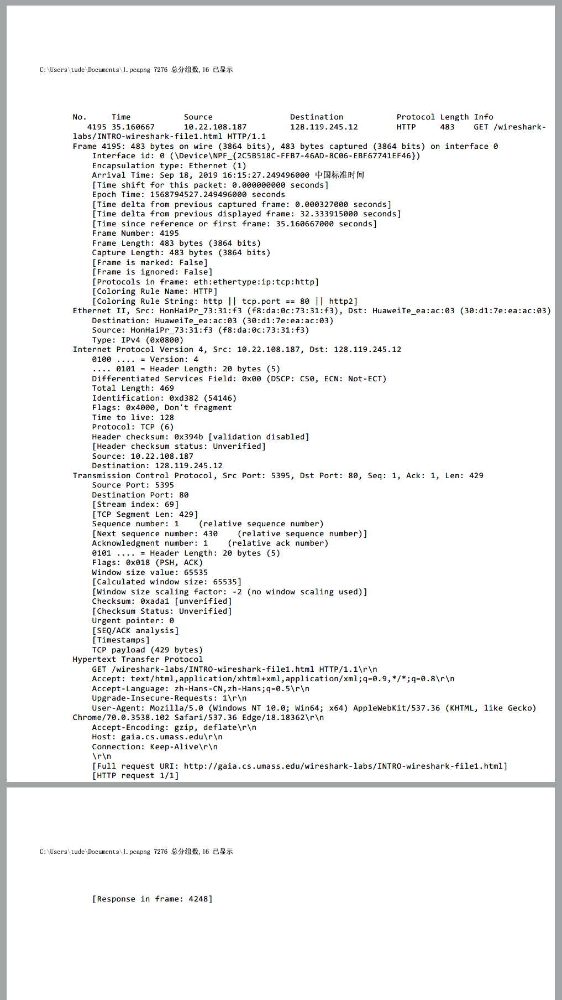
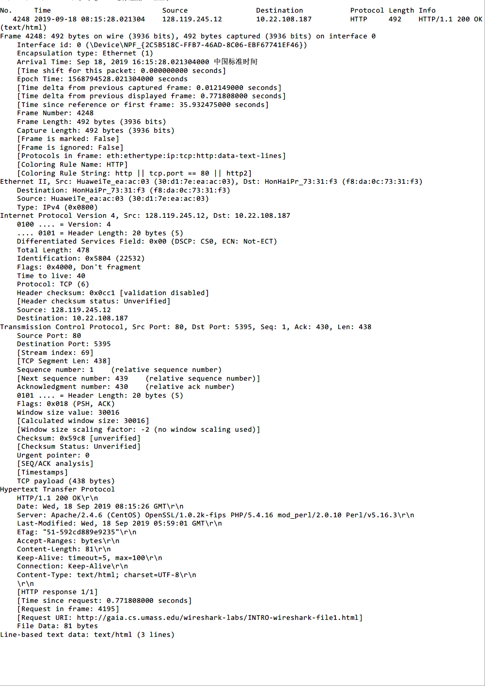

# 计算机网络实验 lab1

姓名：李沛尧

学号：1712901

## Q1
问题：List 3 different protocols that appear in the protocol column in the unfiltered packet-listing window in step 7 above.

答案：DNS, HTTP, TCP

## Q2
问题：How long did it take from when the HTTP GET message was sent until the HTTP OK reply was received? (By default, the value of the Time column in the packetlisting window is the amount of time, in seconds, since Wireshark tracing began. To display the Time field in time-of-day format, select the Wireshark View pull down menu, then select Time Display Format, then select Time-of-day.)

答案：0.7718s

## Q3
问题：What is the Internet address of the gaia.cs.umass.edu (also known as www-net.cs.umass.edu)? What is the Internet address of your computer?

答案：

|本机IP地址|目标IP地址|
|:-:|:-:|
|10.22.108.187|128.119.245.12|

## Q4
问题：Print the two HTTP messages (GET and OK) referred to in question 2 above. To do so, select Print from the Wireshark File command menu, and select the “Selected Packet Only” and “Print as displayed” radial buttons, and then click OK.

答案：

