# 计算机网络实验 lab2

姓名：李沛尧

学号：1712901

## Q1
问题：
1. Is your browser running HTTP version 1.0 or 1.1? What version of HTTP is the server running?

2. What languages (if any) does your browser indicate that it can accept to the server?

3. What is the IP address of your computer? Of the gaia.cs.umass.edu server?

4. What is the status code returned from the server to your browser?

5. When was the HTML file that you are retrieving last modified at the server?

6. How many bytes of content are being returned to your browser?

7. By inspecting the raw data in the packet content window, do you see any headers within the data that are not displayed in the packet-listing window? If so, name one.

答案：

1. HTTP1.1, HTTP1.1

2. zh-Hans-CN, zh-Hans

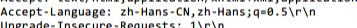

3. 本机IP：10.22.108.187，服务器IP：128.119.245.12

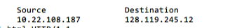

4. 200

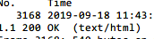

5. 

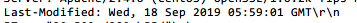

6. 128

7. Date

## Q2

问题：

8. Inspect the contents of the first HTTP GET request from your browser to the server. Do you see an “IF-MODIFIED-SINCE” line in the HTTP GET?

9. Inspect the contents of the server response. Did the server explicitly return the contents of the file? How can you tell?

10. Now inspect the contents of the second HTTP GET request from your browser to the server. Do you see an “IF-MODIFIED-SINCE:” line in the HTTP GET? If so, what information follows the “IF-MODIFIED-SINCE:” header?

11. What is the HTTP status code and phrase returned from the server in response to this second HTTP GET? Did the server explicitly return the contents of the file? Explain.

答案：

8. 没有

9. 有。

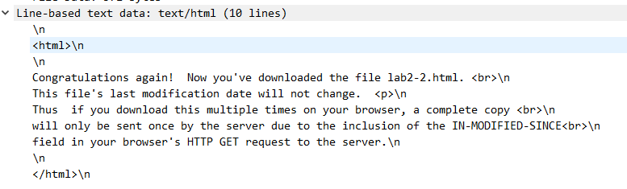

10. 有，If-Modified-Since: Wed, 18 Sep 2019 05:59:01 GMT

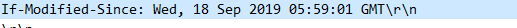

11. 304，没有。因为第二次提交GET请求时，服务器发现内容未修改，故返回304状态码表示页面信息未修改，不用再次返回完整的内容。

## Q3

问题：

12. How many HTTP GET request messages did your browser send? Which packet number in the trace contains the GET message for the Bill or Rights?

13. Which packet number in the trace contains the status code and phrase associated with the response to the HTTP GET request?

14. What is the status code and phrase in the response?

15. How many data-containing TCP segments were needed to carry the single HTTP response and the text of the Bill of Rights?

答案：

12. 1，126

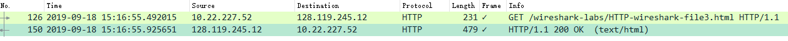

13. 150

14. 200

15. 4

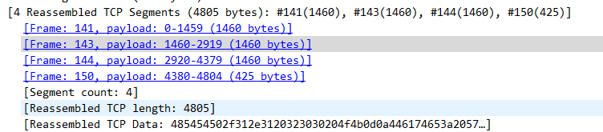

## Q4

问题：

16. How many HTTP GET request messages did your browser send? To which Internet addresses were these GET requests sent?

17. Can you tell whether your browser downloaded the two images serially, or whether they were downloaded from the two web sites in parallel? Explain.

答案：

16. 3个，10.22.277.52

17. 先下载了person.png图片，后下载了cover_5th_ed.jpg图片。他们是串行下载的。可以从图中看到，当person.png图片下载完成后，返回了200状态码，才开始发送获取cover_5th_ed.jpg的GET请求

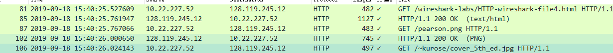

## Q5

问题：

18. What is the server’s response (status code and phrase) in response to the initial HTTP GET message from your browser?
19. When your browser’s sends the HTTP GET message for the second time, what new field is included in the HTTP GET message?

答案：

18. 401

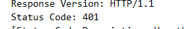

19. 多了一个http.authorization字段，

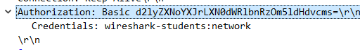
