# 计算机网络实验 lab2

姓名：李沛尧

学号：1712901

## Q3

问题：
4. Locate the DNS query and response messages. Are then sent over UDP or TCP?
5. What is the destination port for the DNS query message? What is the source port of DNS response message?
6. To what IP address is the DNS query message sent? Use ipconfig to determine the IP address of your local DNS server. Are these two IP addresses the same?
7. Examine the DNS query message. What “Type” of DNS query is it? Does the query message contain any “answers”?
8. Examine the DNS response message. How many “answers” are provided? What do each of these answers contain?
9. Consider the subsequent TCP SYN packet sent by your host. Does the destination IP address of the SYN packet correspond to any of the IP addresses provided in the DNS response message?
10. This web page contains images. Before retrieving each image, does your host issue new DNS queries?

答案：

4. UDP
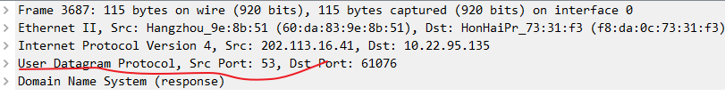

5. 53

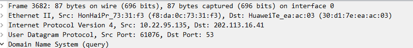

6. 202.113.16.41，是同一个IP

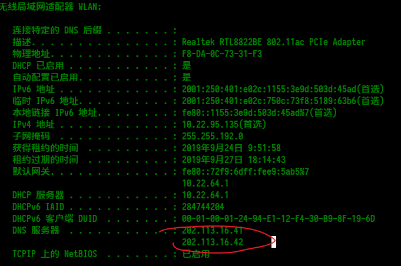
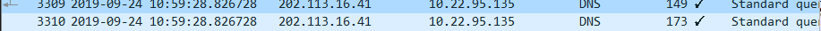

7. A和AAAA，包含了域名和查询类型

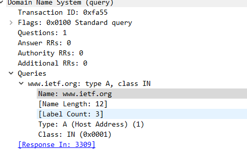
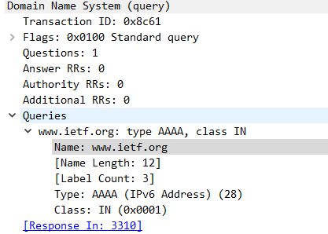

8. A返回了3个，AAAA返回了2个
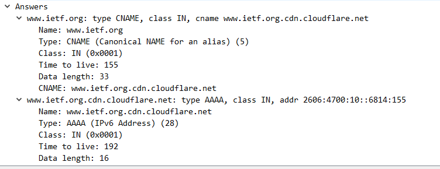
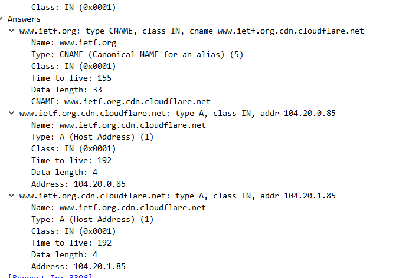

9. 包含的有，向查询到的ipv6地址发起了TCP请求
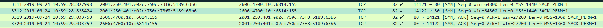

10. 没有发起DNS查询请求，查询目标域名的DNS请求只有一次
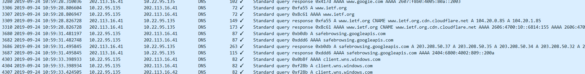

## Q4

问题：
11. What is the destination port for the DNS query message? What is the source port of DNS response message?
12. To what IP address is the DNS query message sent? Is this the IP address of your default local DNS server?
13. Examine the DNS query message. What “Type” of DNS query is it? Does the query message contain any “answers”?
14. Examine the DNS response message. How many “answers” are provided? What do each of these answers contain?
15. Provide a screenshot.

答案：

11. 53，53

12. 202.113.16.41，是

13. A和AAAA，不包含

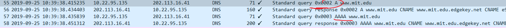

14. 3个和四个

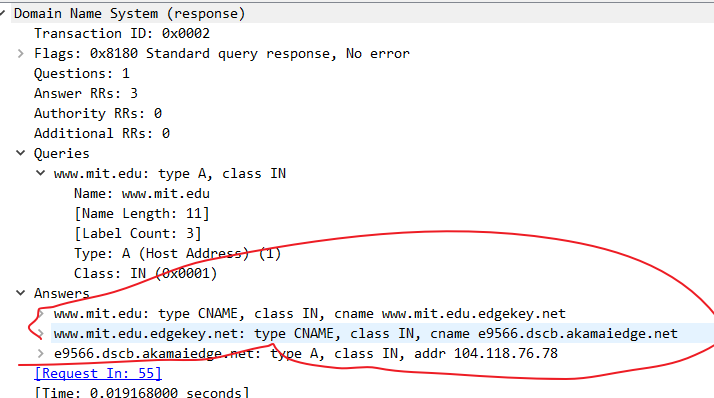
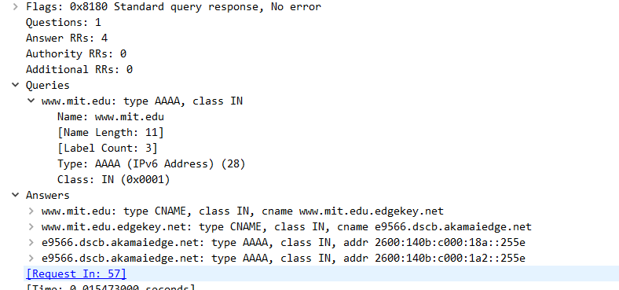

15. 

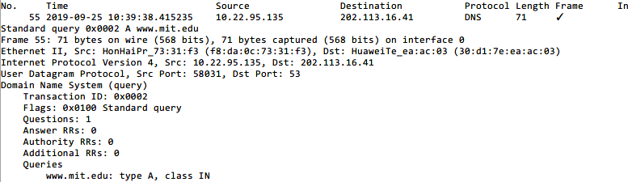
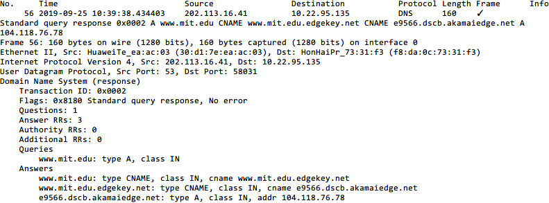
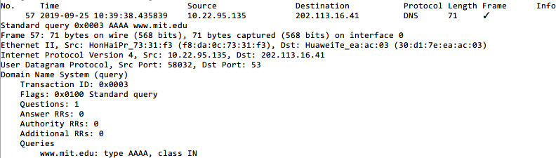
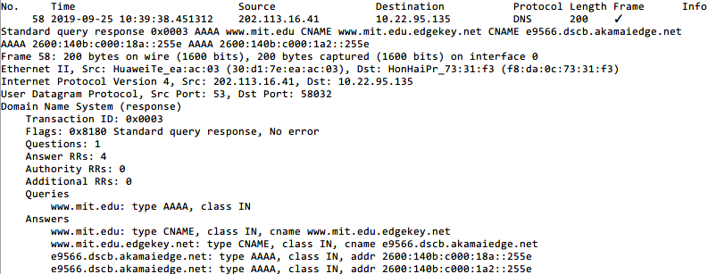

## Q6

问题：

16. To what IP address is the DNS query message sent? Is this the IP address of your default local DNS server?
17. Examine the DNS query message. What “Type” of DNS query is it? Does the query message contain any “answers”?
18. Examine the DNS response message. What MIT nameservers does the response message provide? Does this response message also provide the IP addresses of the MIT namesers?
19. Provide a screenshot.

答案：

16. 202.113.16.41，和本地DNS服务器一致

17. NS，不包含

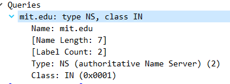

18. 返回信息如图，不包含MIT名称服务IP地址

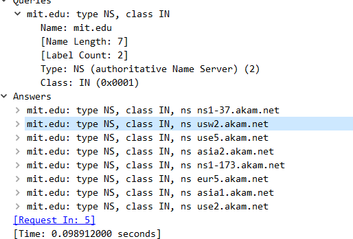

19. 

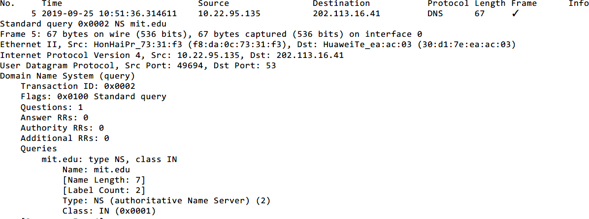
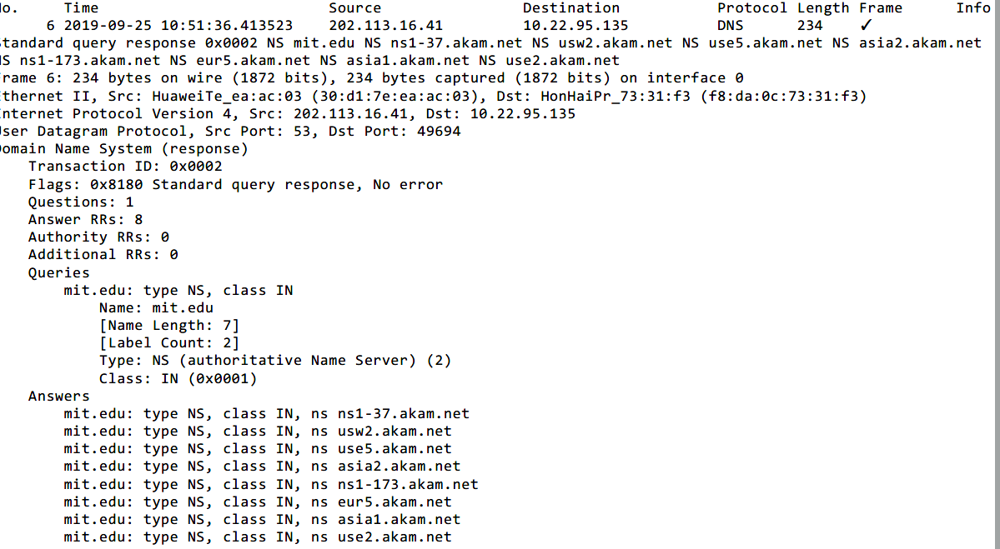

## Q7

问题：

20. To what IP address is the DNS query message sent? Is this the IP address of your default local DNS server? If not, what does the IP address correspond to?
21. Examine the DNS query message. What “Type” of DNS query is it? Does the query message contain any “answers”?
22. Examine the DNS response message. How many “answers” are provided? What does each of these answers contain?
23. Provide a screenshot.

答案：

20. 18.72.0.3 MIT的DNS服务器

21. A，不包含

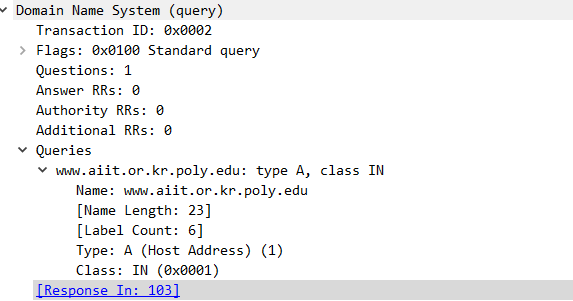
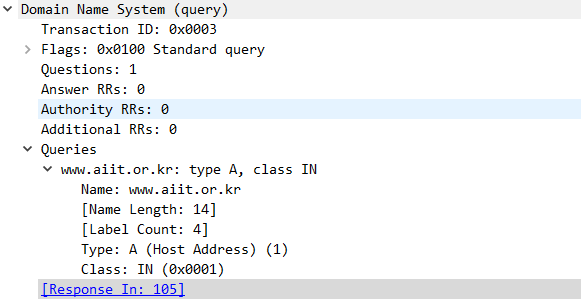

22. 0个，两个

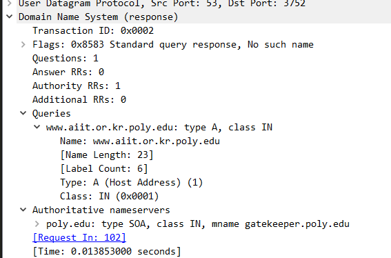
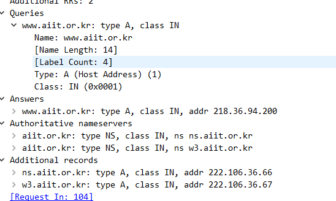

23. 

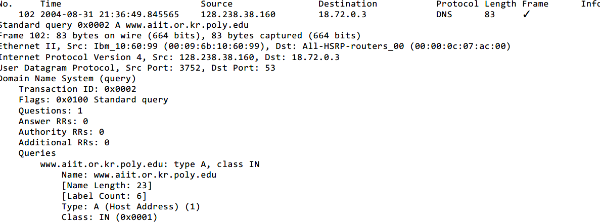
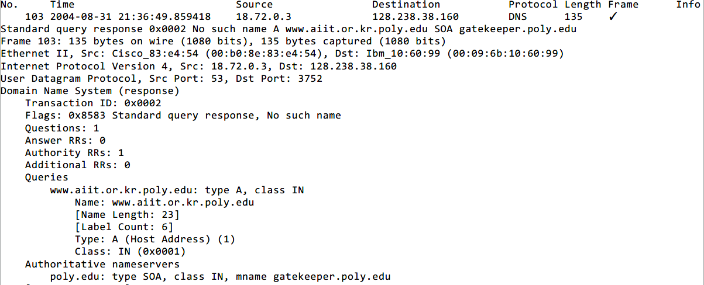
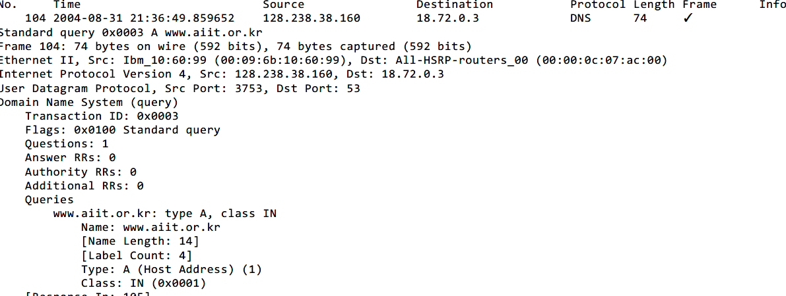
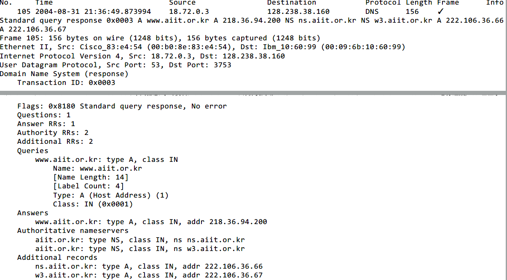
