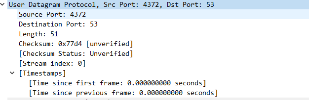
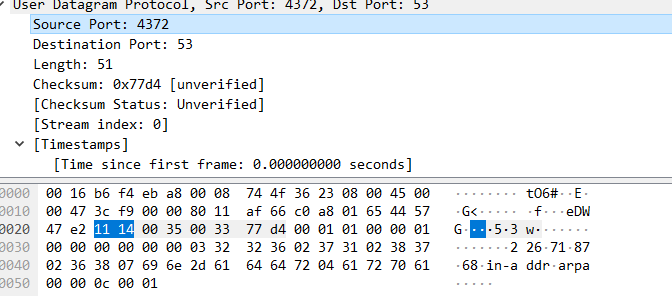
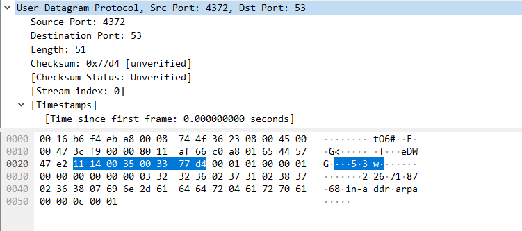
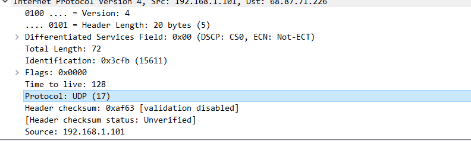
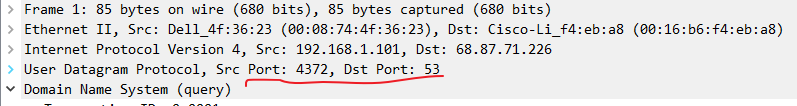
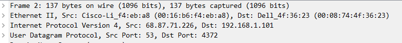

# 计算机网络实验 lab4

姓名：李沛尧

学号：1712901

## Q1

问题：

1. Select one UDP packet from your trace. From this packet, determine how many fields there are in the UDP header. (You shouldn’t look in the textbook! Answer these questions directly from what you observe in the packet trace.) Name these fields.
2. By consulting the displayed information in Wireshark’s packet content field for this packet, determine the length (in bytes) of each of the UDP header fields.
3. The value in the Length field is the length of what? (You can consult the text for this answer). Verify your claim with your captured UDP packet.
4. What is the maximum number of bytes that can be included in a UDP payload? (Hint: the answer to this question can be determined by your answer to 2. above)
5. What is the largest possible source port number? (Hint: see the hint in 4.)
6. What is the protocol number for UDP? Give your answer in both hexadecimal and decimal notation. To answer this question, you’ll need to look into the Protocol field of the IP datagram containing this UDP segment (see Figure 4.13 in the text, and the discussion of IP header fields).
7. Examine a pair of UDP packets in which your host sends the first UDP packet and the second UDP packet is a reply to this first UDP packet. (Hint: for a second packet to be sent in response to a first packet, the sender of the first packet should be the destination of the second packet). Describe the relationship between the port numbers in the two packets.

答案：

1. 4个，Sourse Port，Destination Port，Length，Checksum

    

2. 16bits

    

3. 数据包的长度

    如图所示，UDP包带上包头共有51*8bit的数据，而长度刚好是51

    

4. 最大是65528*8bit的数据，理由如下

    由于Length头占16bit，2^16=65536，减去4个包头，还有65528

5. 65535，因为2^16-1=65535

6. 17（10进制），0x11（16进制）

    

7. 发送时和接受时UDP端口号刚好相反

    

    
