# 计算机网络实验 lab4

姓名：李沛尧

学号：1712901

## Q1

1. Select the first ICMP Echo Request message sent by your computer, and expand the Internet Protocol part of the packet in the packet details window.What is the IP address of your computer?

2. Within the IP packet header, what is the value in the upper layer protocol field?

3. How many bytes are in the IP header? How many bytes are in the payload of the IP datagram? Explain how you determined the number of payload bytes.

4. Has this IP datagram been fragmented? Explain how you determined whether or not the datagram has been fragmented.

5. Which fields in the IP datagram always change from one datagram to the next within this series of ICMP messages sent by your computer?

6. Which fields stay constant? Which of the fields must stay constant? Which fields must change? Why?

7. Describe the pattern you see in the values in the Identification field of the IP datagram

8. What is the value in the Identification field and the TTL field?

9. Do these values remain unchanged for all of the ICMP TTL-exceeded replies sent to your computer by the nearest (first hop) router? Why?

答案：

1. 192.168.1.102

    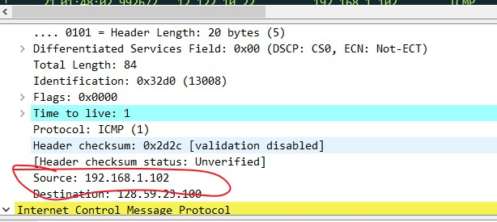

2. 协议为ICMP，值为01

    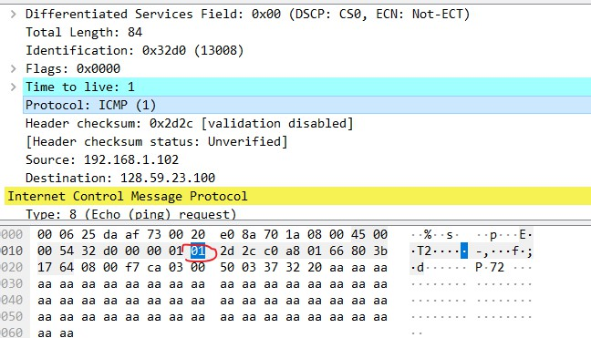

3. 头长度为20bytes，IP数据报文长度为64，Total Length为84，头长度为20，故报文长度为64

    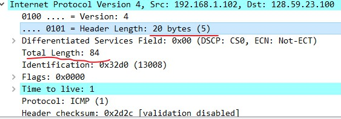

4. 没有，因为相应字段为0

    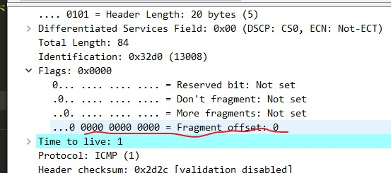

5. Identification，Time to live，checksum字段会一直改变

    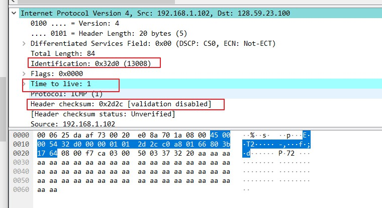

6. 如下，红色一定不变，蓝色未改变，绿色必须改变

    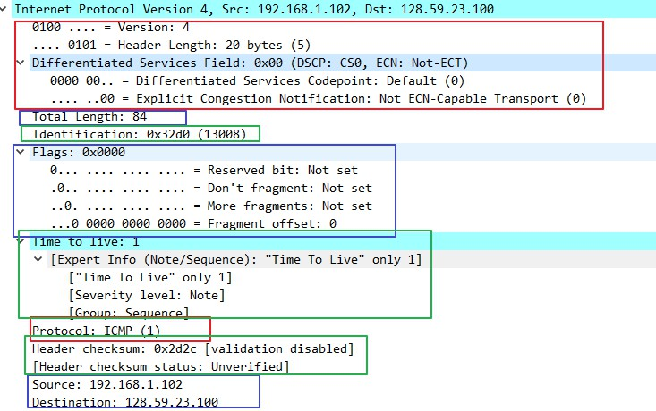

7. 如图所示

    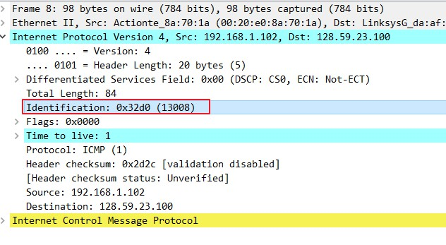

8. 如图所示

    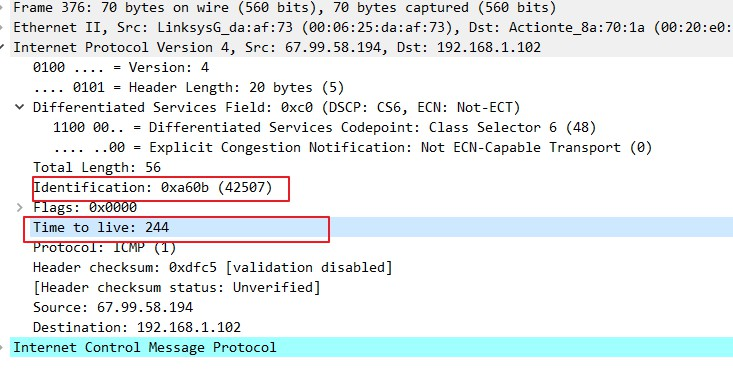

9. ID改变但TTL不变

## Q2

10. Find the first ICMP Echo Request message that was sent by your computer after you changed the Packet Size in pingplotter to be 2000. Has that message been fragmented across more than one IP datagram? [Note: if you find your packet has not been fragmented, you should download the zip file http://gaia.cs.umass.edu/wireshark-labs/wireshark-traces.zip and extract the ipethereal- trace-1packet trace. If your computer has an Ethernet interface, a packet size of 2000 should cause fragmentation.]

11. Print out the first fragment of the fragmented IP datagram. What information in the IP header indicates that the datagram been fragmented? What information in the IP header indicates whether this is the first fragment versus a latter fragment? How long is this IP datagram?

12. Print out the second fragment of the fragmented IP datagram. What information in the IP header indicates that this is not the first datagram fragment? Are the more fragments? How can you tell?

13. What fields change in the IP header between the first and second fragment?

14. How many fragments were created from the original datagram?

15. What fields change in the IP header among the fragments?

答案：

10. 分割了

    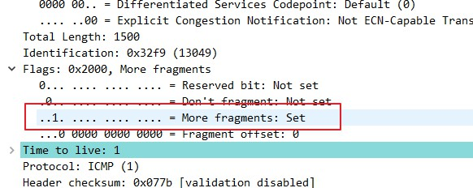

11. More fragments表示了分割，Fragment offset表示是第一个，TotalLength表示长度

    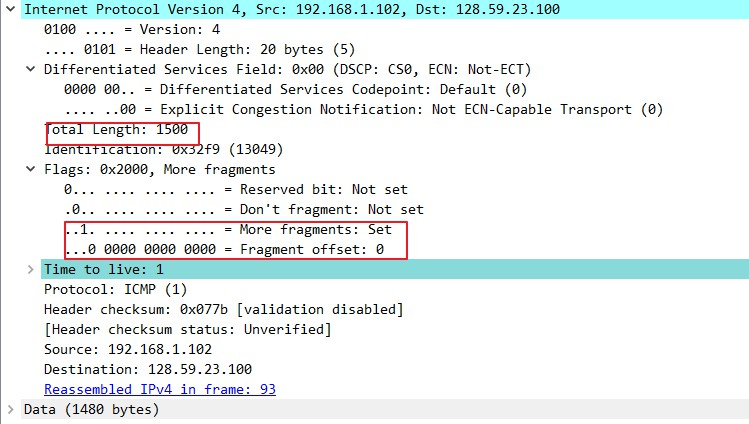

12. More fragments和Fragment offset

    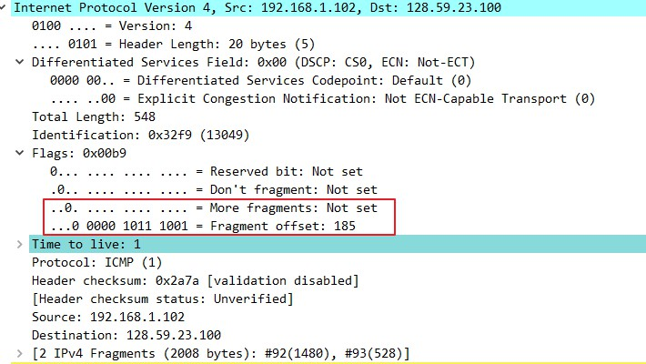

13. IP 头的 ID，标志位，以及校验码

14. 3个

    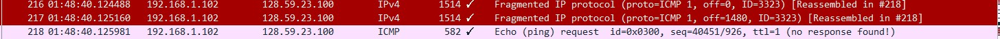

15. 同13
