# 计算机网络实验 lab7

姓名：李沛尧

学号：1712901

## Q1

1. 客户机的IP地址是192.168.1.100

    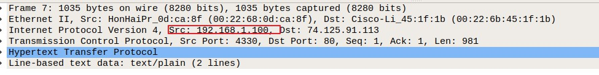

2. 略

3. 源ip为192.168.1.100，目标ip为64.233.169.104，目标TCP端口为80

    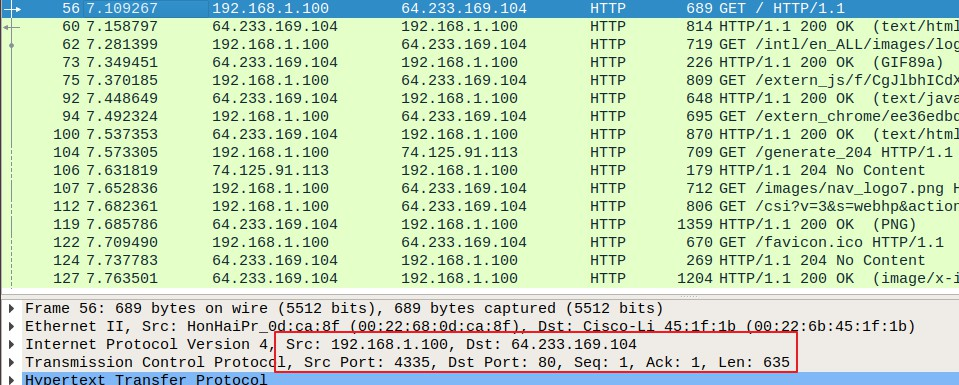

4. 时间为7.158797，源IP为64.233.169.104，目标IP为192.168.1.100，端口4335

    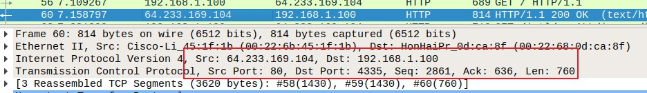

5. ACK报文：源IP为192.168.1.100，源端口为4435。目标IP为64.233.169.104，目标端口为80。ACK SYN报文：源IP、端口，目标IP、端口与ACK报文恰好相反

    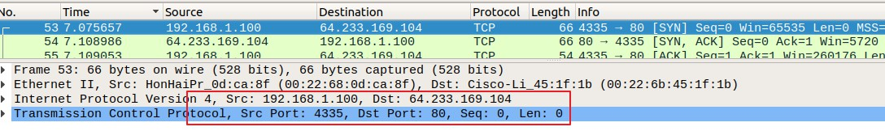

    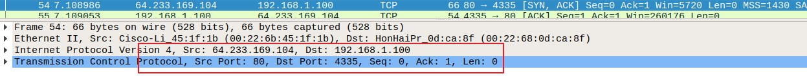

6. 出现时间：6.069168。源IP 71.192.34.104，源端口4335。目标IP 64.233.169.104，目标端口80。TTL，checksum，ip改变了

    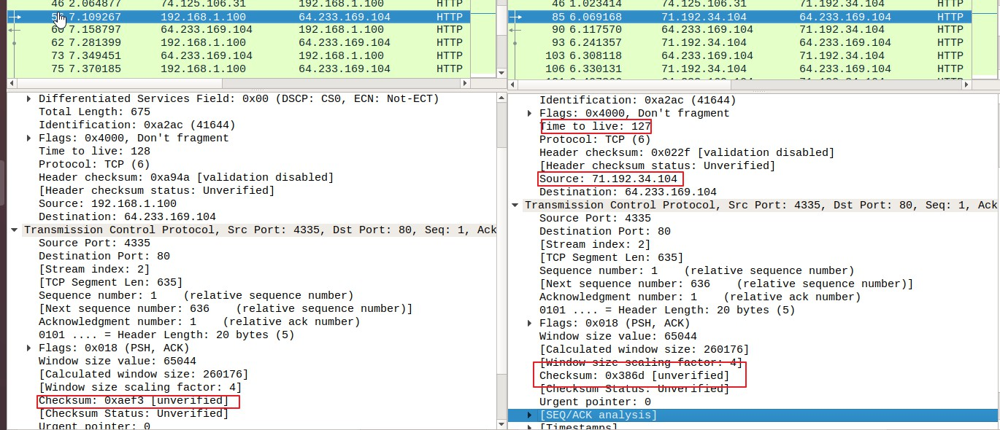

7. HTTP GET信息完全一致。IP校验和更改

    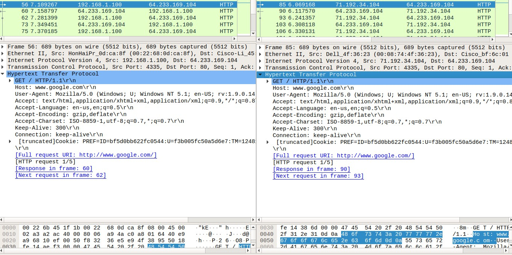

    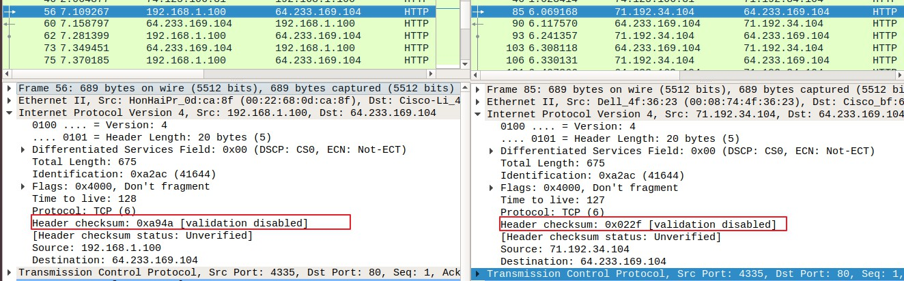

8. 6.117570。源IP64.233.169.104，源端口80。目的 IP 71.192.34.104，目的端口4335

    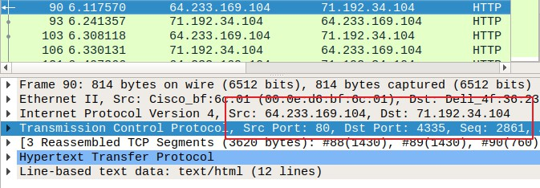

9. SYN：6.035475。源IP71.192.34.104，源端口4335。目标 IP 64.233.169.104。目标端口80。ACK SYN与SYN相反。IP包的生存时间，校验和，发送源IP

    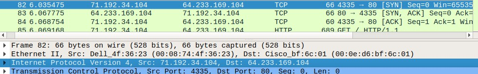

    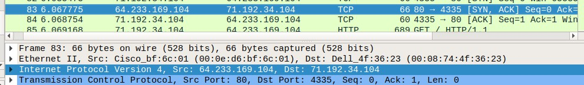

10. NAT表

    ||WAN side|LAN side|
    |:-:|:-:|:-:|
    |ip|71.192.34.104|71.192.34.104|
    |port|4335|4335|
