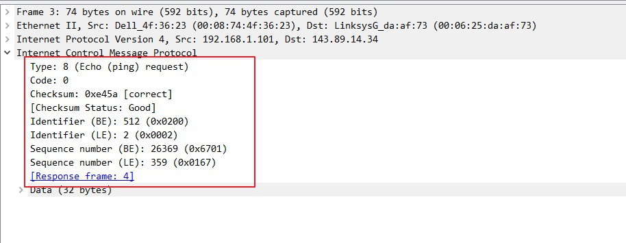
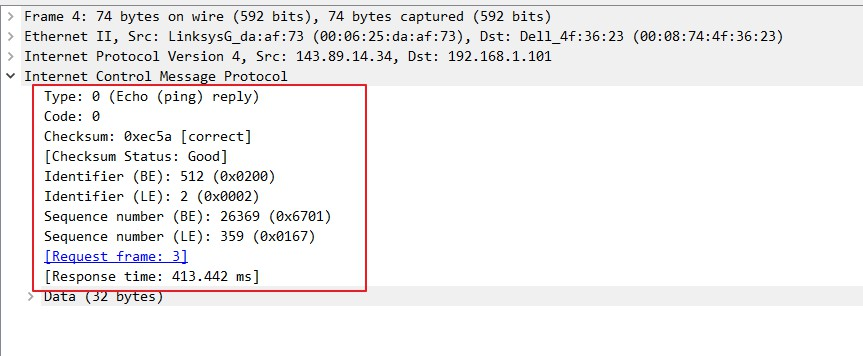
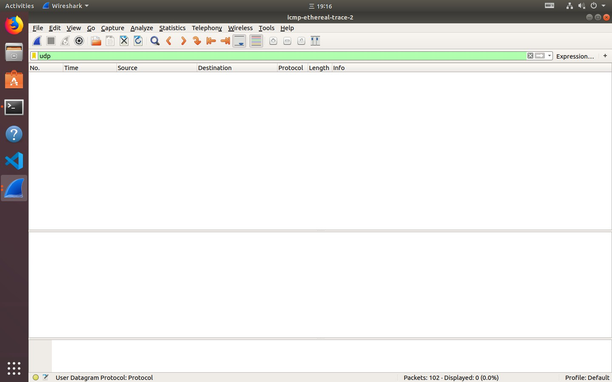
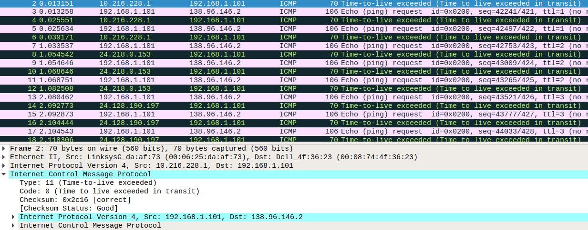

# 计算机网络实验 lab8

姓名：李沛尧

学号：1712901

## Q1

1. 本机IP为192.168.1.100，目的IP为143.89.14.34

    

2. 因为ICMP协议是网络层的协议，它不需要传输层TCP和UDP承载

3. 类型是8，代码为0，还包括校验码，ID值，序列号。都是2字节

    

4. 类型是0（ICMP响应），代码为0，还包括校验码，ID值，序号。长度都是2字节

    

5. 主机IP为192.168.1.100，目标IP为138.96.146.2

    

6. 没找到UDP

    

7. 校验和与序列号不一样

8. 多了ICMP请求部分

    

9. Type不一样。最后的 ICMP查询数据包的 TTL 已经大于到达目的主机中间路由跃点数，因此不会被目标主机丢弃，发送 ICMP 超时的数据包，所以只会收到 ICMP 响应数据包。
