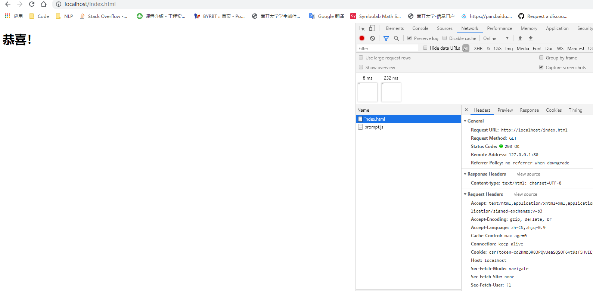

# 计算机网络实验：WebServer

姓名：李沛尧

学号：1712901

## 实验内容

实现一个简单的Web Server

## 实验内容分析

1. 要处理HTTP请求，需要对请求的URL进行处理，从而定位请求的资源

2. 若定位成功，则打开相应文件，向其中写入文件二进制数据

3. 若打开失败，向链接中写入失败相应的信息

## 源代码

```py
#import socket module
from socket import *
import sys # In order to terminate the program
# 自定义文件路径
FILE_PATH = '/home/admin/data/'
serverSocket = socket(AF_INET, SOCK_STREAM)
#Prepare a sever socket
#Fill in start
serverSocket.bind(('localhost', 80))
serverSocket.listen(1)
#Fill in end
while True:
    #Establish the connection
    print('Ready to serve...')
    connectionSocket, addr = serverSocket.accept()
    try:
        message = connectionSocket.recv(1024).decode().split('\r\n')[0]
        filename = message.split()[1]
        print(FILE_PATH + filename[1:])
        f = open(FILE_PATH + filename[1:], encoding='UTF-8')
        outputdata = f.read()
        #Send one HTTP header line into socket
        #Fill in start
        connectionSocket.send('HTTP/1.1 200 OK\r\n'.encode())
        connectionSocket.send('Content-type: text/html; charset=UTF-8\r\n\r\n'.encode())
        #Fill in end
        #Send the content of the requested file to the client
        for i in range(0, len(outputdata)):
            connectionSocket.send(outputdata[i].encode())
        connectionSocket.send("\r\n".encode())
        connectionSocket.close()
    except IOError as e:
        #Send response message for file not found
        #Fill in start
        connectionSocket.send('HTTP/1.1 404 Not Found\r\n'.encode())
        connectionSocket.send('Content-type: text/html; charset=UTF-8\r\n\r\n'.encode())
        connectionSocket.send('404 Not Found\r\n'.encode())
        #Fill in end
        #Close client socket
        #Fill in start
        connectionSocket.close()
        #Fill in end
serverSocket.close()
sys.exit()#Terminate the program after sending the corresponding data
```

## 结果截图

成功请求：



失败请求：


## 附：index.html

```html
<!DOCTYPE html>
<html>
    <head>
        <title>Test Webserver</title>
    </head>
    <body>
        <h1>恭喜！</h1>
    </body>
</html>
```
